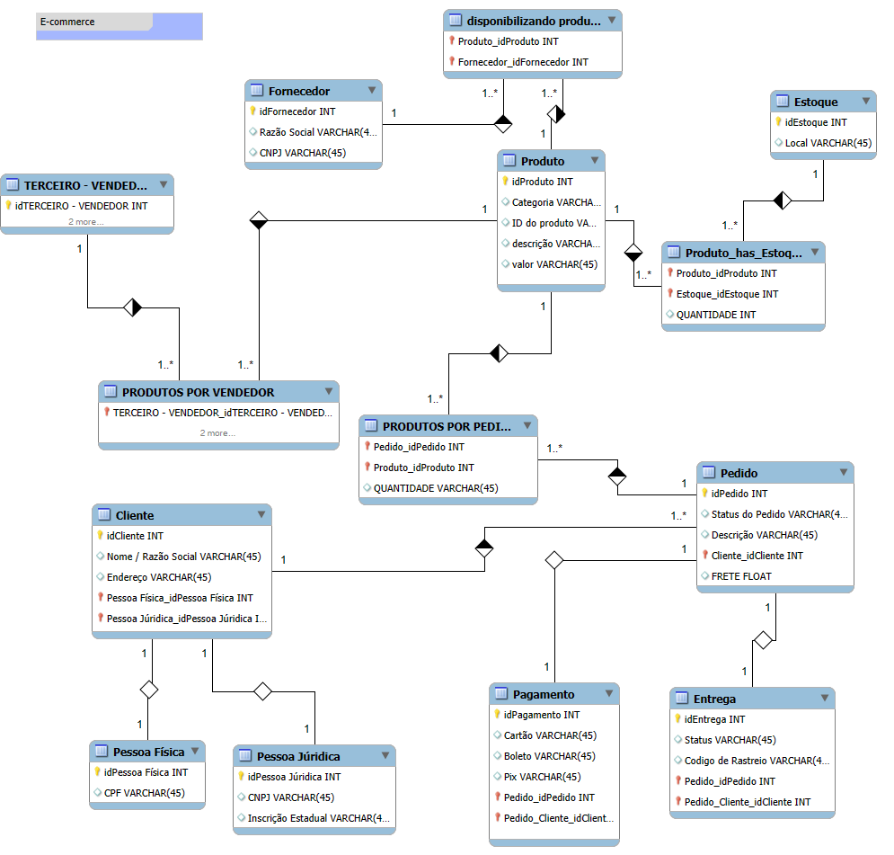

# E-commerce-MySQL-DIO-desafio
Modelando um banco de dados de um E-commerce

# Diagrama de Banco de Dados - E-commerce

## Visão Geral

Este diagrama representa a estrutura do banco de dados do sistema E-commerce. Ele descreve as entidades (tabelas), seus atributos e os relacionamentos entre elas.

## Tabelas

* **Fornecedor:** Armazena informações sobre os fornecedores dos produtos.
* **Terceiro/Vendedor:** Armazena informações sobre terceiros ou vendedores que não são fornecedores diretos.
* **Produto:** Armazena informações sobre os produtos, como categoria,, id do produto, descrição e valor.
* **Estoque:** Armazena informações sobre o local do estoque.
* **Pedido:** Armazena informações sobre status, descrição, id do cliente e frete.
* **Cliente:** Armazena informações sobre os clientes, como nome e endereço. 
* **Pessoa Física:** Armazena informações específicas de pessoas físicas, como CPF.
* **Pessoa Jurídica:** Armazena informações específicas de pessoas jurídicas, como CNPJ.
* **Entrega:** Armazena informações sobre a entrega dos pedidos como status, cod de rastreio, id pedido e id do cliente.
* **Pagamento:** Armazena informações sobre as formas de pagamentos.

## Relacionamentos

* **Fornecedor - Produto:** Relação de N:N, indicando que um fornecedor pode fornecer muitos produtos e um produto pode ser fornecido por muitos fornecedores.
* **Terceiro/Vendedor - Produto:** Relação de N:N, indicando que um terceiro/vendedor pode vender muitos produtos e um produto pode ser vendido por muitos terceiros/vendedores.
* **Estoque - Produto:** Relação de N:N, indicando que um produto pode estar em vários estoques e um estoque pode conter muitos produtos.
* **Pedido - Produto:** Relação de N:N, indicando que um pedido pode conter muitos produtos e um produto pode estar em muitos pedidos.
* **Entrega - Pedido:** Relação de 1:1, indicando que cada pedido tem uma única entrega.
* **Pagamento - Pedido:** Relação de 1:1, indicando que cada pedido tem um único pagamento.
* **Pessoa Física - Cliente:** Relação de 1:1, indicando que um cliente pode ser uma pessoa física.
* **Pessoa Jurídica - Cliente:** Relação de 1:1, indicando que um cliente pode ser uma pessoa jurídica.

## Diagrama ER 

## Observações

* **Futuras melhorias:** refinamento mais apurado.

